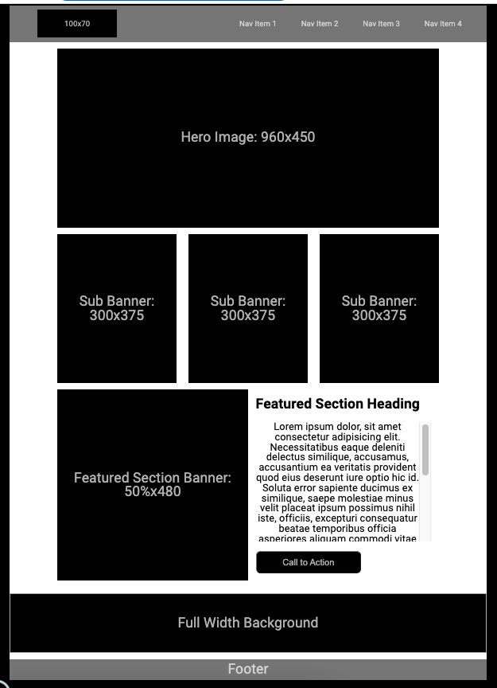

# wirefame-exercise 201class-08

### Lab 201class-08 - wireframe

[REP Link](https://github.com/VMO2020/wirefame-exercise/settings/pages)

[WEB Link](https://vmo2020.github.io/wirefame-exercise/)

### Exercise info

